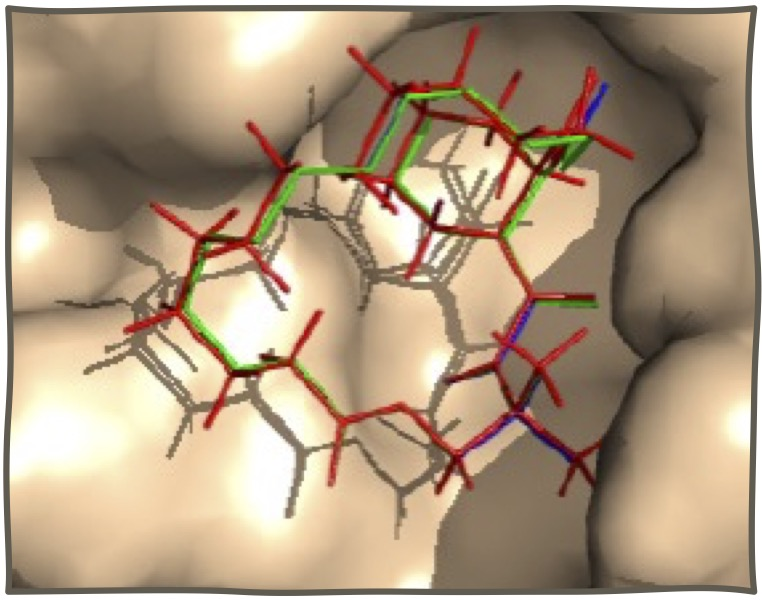

## Welcome to Computational Biology and Artificial Intelligence Lab

[Shirley Siu](shirleysiu.md) | Members | Research | [Publications](publications.md) | [Software](https://app.cbbio.online)

We focus on the development of bioinformatics tools for drug discovery and design. We design optimization algorithms, machine learning and deep learning methods to tackle critical drug discovery problems such as protein-ligand binding, drug target identification, biological activity and toxicity predictions. We are also interested in modeling and simulating important biomolecules to understand their mode of action.

This site is still under construction, please check back later

### Check out our openings
- [Call for application - Postdoctoral researcher](vacancy.md) ([中文版](vacancy_cn.md))

<!--- 
--->

### Links
- [Shirley Siu's Lab page at University of Macau](https://cbbio.online)
- [Institute of Science and Environment, University of Saint Joseph](http://ise.usj.edu.mo/)
