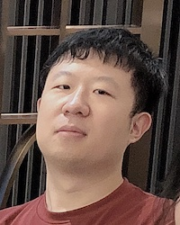
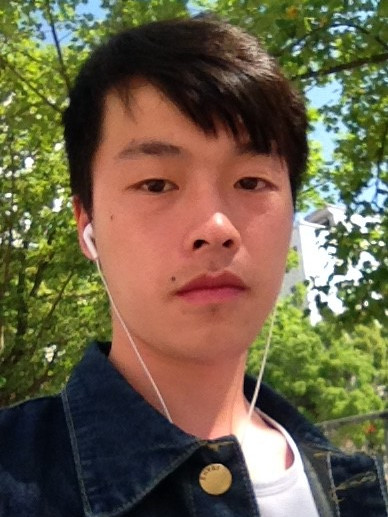
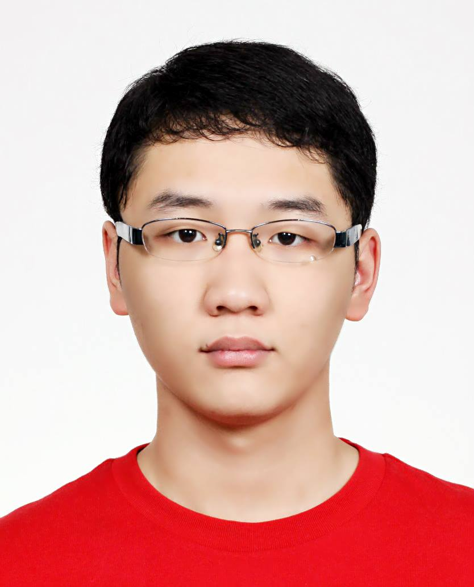
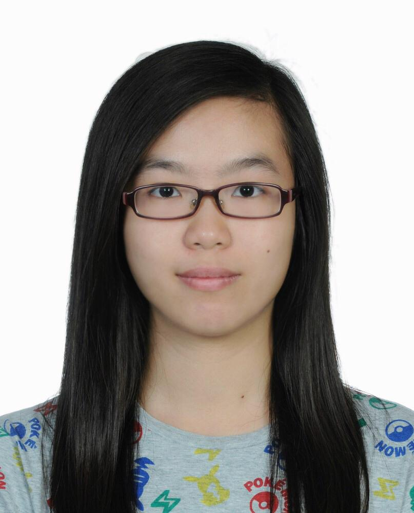
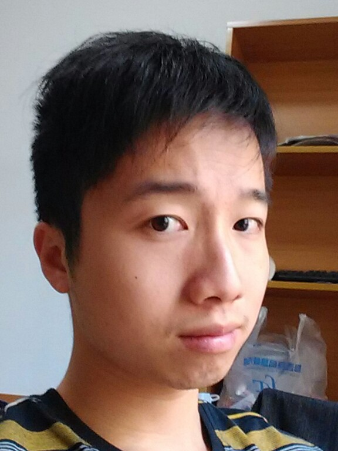
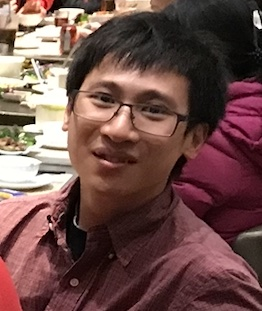
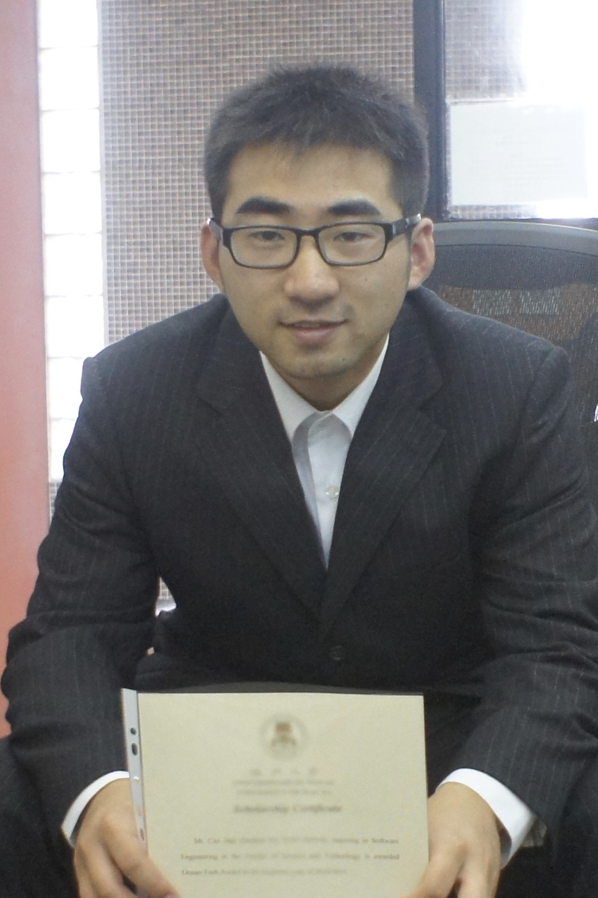

# Members 

## Co-supervised UM Students
### Jie Lu YAN (PhD student) 
 
- BSc Information Countermeasure Technology, Faculty of Electro-Optical Engineering, Changchun University of Science and Technology
- MSc Computer and Information Science, Univerisity of Macau, Macau
- Master thesis: Development and validation of deep learning classifiers for antimicrobial peptide prediction (May 2018) 
- Research interest: Deep learning model for peptide prediction

### Carter Hong Hin CHEONG (Master student)

 
- BSc Computer Science, University of Macau, Macau
- Research interest: Feature representation and feature selection methods in machine learning

### Chonwai UN (part-time RA) 
 
- BSc Computer Science, University of Macau, Macau
- Task: Development and maintainance of the [app server](https://app.cbbio.online)

---
## Previous members of CBBio Lab at University of Macau
### Ray Jiarui CHEN (Master student)         
 
- BSc Computer Science and Technology, Northwestern Polytechnical University, Ming De College, China
- MSc thesis: Improving Machine Learning Based Toxicity Prediction: From Supervised Learning to Semi-supervised Learning (June 2021)

### Faraz Mohammadali Shaikh (PhD student)       

- MSc Bioinformatics, Sri Ramachandra University, India
- BSc Bioinformatics, University of Saurashtra, India
- PhD thesis: Computational Approaches for Target Identification and Novel Inhibitor Discovery (May 2020)
- Current: Postdoc at Institute for Research in Immunology and Cancer (IRIC), University of Montreal, Canada

### Pratiti Bhadra (Postdoc)
- BTech Information Technology, RCC Institute of Information Technology (WBUT), Kolkata, West Bengal, India
- PhD Interdisciplinary Mathematical Sciences PhD program (Computational Biology Stream), Indian Institute of Science, Bangalore, India
- Research area: molecular dynamics simulation of self-assembled monolayers
- Current: Postdoc with Volkhard Helms, Center of Bioinformatics, Saarland University, Germany

### Lu GAO (Master student) 

- BSc Computer Software and Theory, Jiangxi Agricultural University, China
- Master thesis: Enhance protein-peptide prediction with imbalanced ensemble learner (July 2020)

### Kin Meng WONG (Master student) 

- Master thesis: Application of grey wolf optimizer and side-chain rotamer library for flexible receptor docking (July 2020)

### Meng Chi AO (Master student) 
- Master thesis: Evaluating variants of firefly algorithm for ligand pose prediction in protein-ligand docking program (May 2020)

### Hoi Kuan TAI (Master student) 

- Master thesis: Protein-ligand docking and virtual screening based on chaos-embedded particle swarm optimization (May 2018)

### Hang LIN (Master student) 

- Master thesis: A novel hybrid cuckoo search-quasi differential equation algorithms and its application on flexible protein-ligand docking (2017)

### Hoi Kei CHAN (Master student) 

- Master thesis: Computational modeling of nanodroplet wetting on a single-plate coplanar electrodes (June 2017)

### Choi Fong NGAI (Master student) 

- Master thesis: Predicting favorable protein docking poses on a solid surface by particle swarm optimization (May 2015)

### Han CAO (Master student) 

- Master thesis: An improved algorithm for the prediction of dimeric transmembrane domains of bitopic proteins (August 2014)

