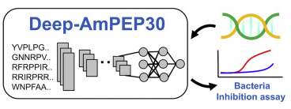
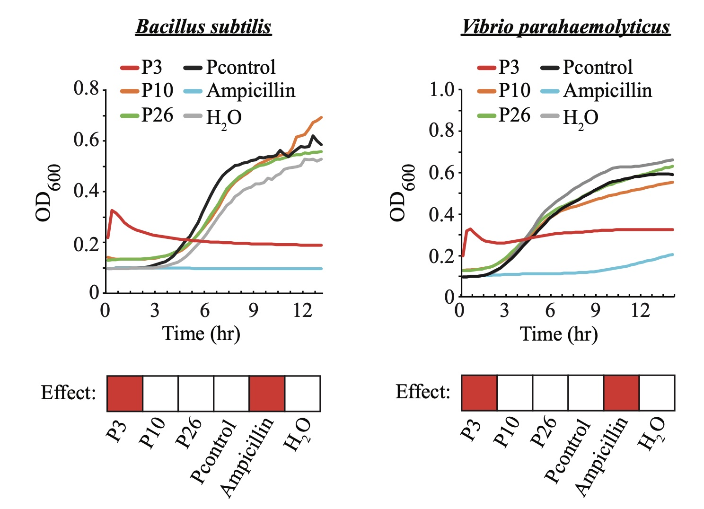

# Research

## Novel Antimicrobial Peptides Discovery from Fungal Genomes using Machine Learning  

||
| :-: |
|**Visit our one-stop AMP prediction server [AxPEP](https://app.cbbio.online/ampep/home)**|

Antimicrobial peptides (AMPs) are a valuable source of antimicrobial agents and a potential solution to the multi-drug resistance problem. In particular, short-length AMPs have been shown to have enhanced antimicrobial activities, higher stability, and lower toxicity to human cells. We developed two short-length (less than 30 aa) AMP prediction methods, Deep-AmPEP30 and RF-AmPEP30, based on an optimal feature set of PseKRAAC reduced amino acids composition, convolutional neural network, and random forest. They showed remarkable improvements over four existing ML and DL methods. 

To demonstrate their power, we screened the genome sequence of *Candida glabrata*—a gut commensal fungus expected to interact with and/or inhibit other microbes in the gut—for potential AMPs and identified a peptide of 20 aa (P3, FWELWKFLKSLWSIFPRRRP) with strong anti-bacteria activity against 
*Bacillus subtilis* and *Vibrio parahaemolyticus*. The potency of the peptide is remarkably comparable to that of the antibiotics *ampicillin*. 

Therefore, Deep-AmPEP30 and RF-AmPEP30 are promising tools in identifying short-length AMPs, and their application on the vast amount of publicly available genomic sequences would leverage short-length AMPs to their full potential in novel drug discovery and development.

> References:
>   - Yan, J.; Bhadra, P.; Li, A.; Sethiya, P.; Qin, L.; Tai, H. K.; Wong, K. H.; and Siu, Shirley W. I.* **Deep-AmPEP30: Improve short antimicrobial peptides prediction with deep learning**. Molecular Therapy - Nucleic Acid 2020, 20, 882-894.
>   - Bhadra, P.; Yan, J.; Li, J.; Fong, S.; Siu, Shirley W. I.* **AmPEP: Sequence-based prediction of antimicrobial peptides using distribution patterns of amino acid properties and random forest**. Scientific Reports 2018, 8, 1697. JCR-Q1

## Links
- [Shirley Siu's Lab page at the University of Macau](https://cbbio.online)
- [Institute of Science and Environment, University of Saint Joseph, Macau](http://ise.usj.edu.mo/)

