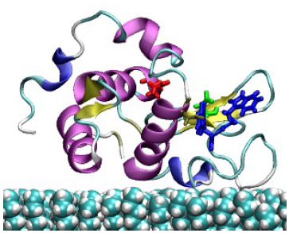

# Server
## Our app server [https://app.cbbio.online](https://app.cbbio.online) hosts the methods that can be accessed directly online

[AxPEP](https://app.cbbio.online/ampep/home) Antimicrobial peptide classification methods AmPEP, Deep-AmPEP30, RF-AmPEP30 | <kbd></kbd> 

[AcPEP](https://app.cbbio.online/acpep/home) Anticancer peptide classification and cancer-type biological activity prediction  xDeep-AcPEP | <kbd></kbd>

[LigTMap](https://cbbio.online/LigTMap) Chemical compound target identification and activity prediction | <kbd></kbd>

[BESTox](https://app.cbbio.online/bestox/home) Chemical compound toxicity prediction (acute oral toxicity LD50 value) | <kbd></kbd> 

---
# Downloadable Software
## Protein-Ligand Docking 
 
[PSOVina](https://app.cbbio.online/psovina/home)
  
 
[GWOVina](https://app.cbbio.online/gwovina/home)

## Self-Assembled Monolayers

[SAMFF](https://sourceforge.net/projects/samff/) A refined empirical force field to model protein-SAM interactions based on GAFF and AMBER14 

